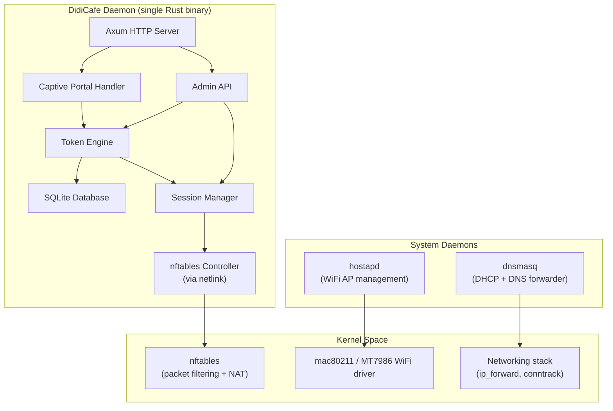
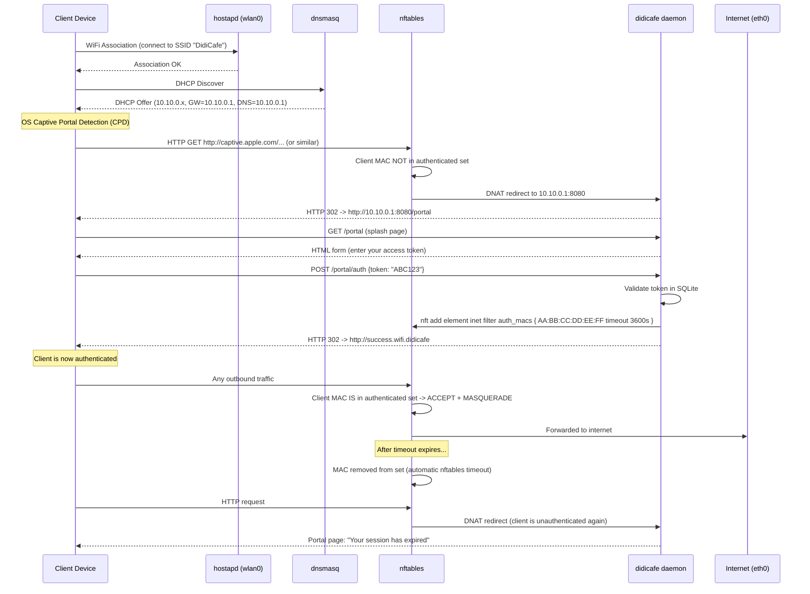
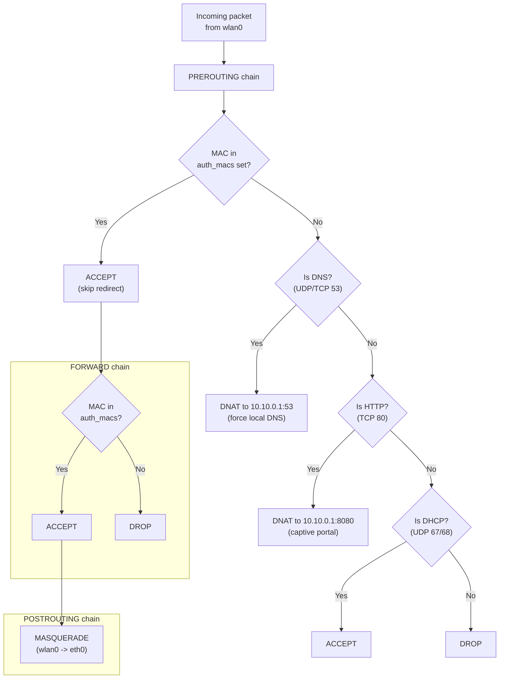
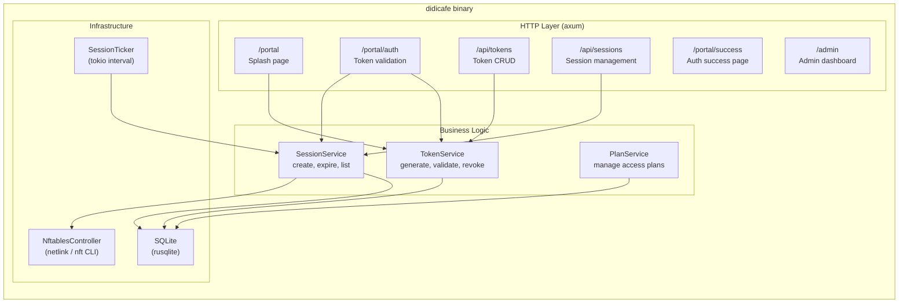
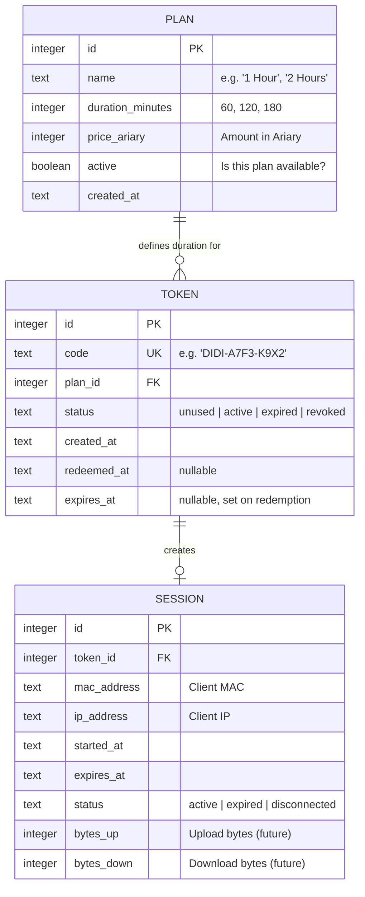
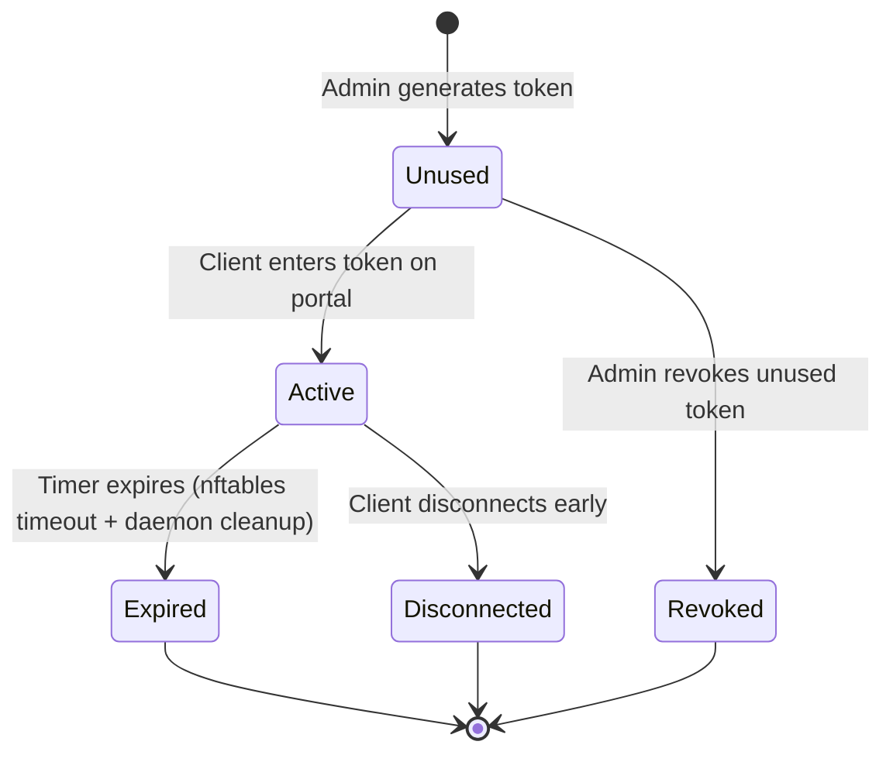
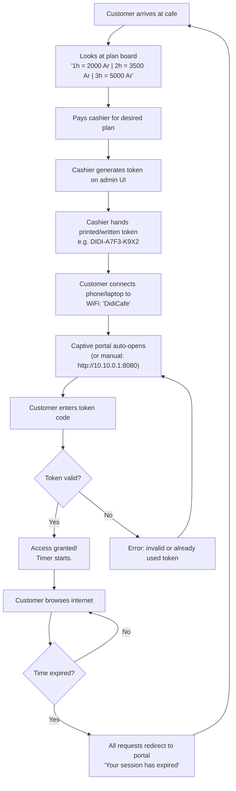
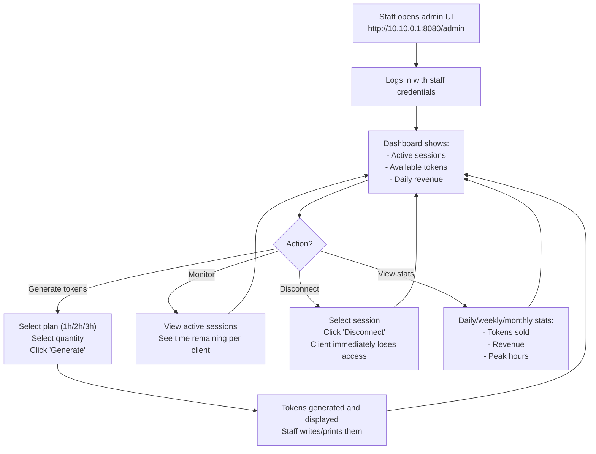
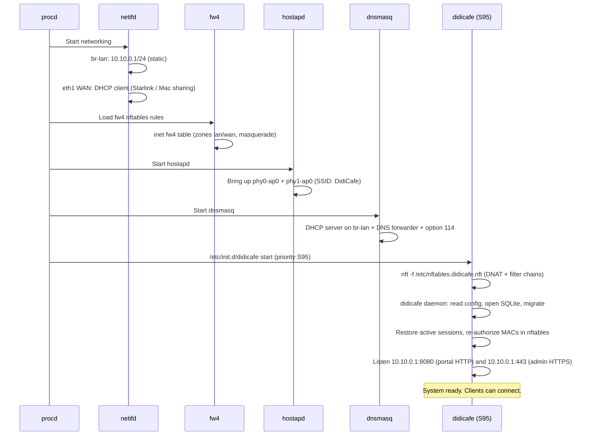

# DidiCafe - Captive Portal System Design

A single-SBC, all-in-one WiFi captive portal for time-limited internet access.
One device. One binary. No multi-layer hacks.

---

## 1. System Overview

```
                        INTERNET
                           |
                    [Starlink Dish]
                           |
                      (Ethernet)
                           |
                  +--------+--------+
                  | SBC (BPI-R3 Mini)|
                  |                 |
                  |  eth0 (WAN)    |  <-- DHCP client, gets IP from Starlink
                  |  wlan0 (AP)    |  <-- hostapd, serves WiFi to clients
                  |                 |
                  |  +-----------+  |
                  |  | didicafe  |  |  <-- Single Rust binary
                  |  | daemon    |  |
                  |  +-----------+  |
                  |  | hostapd   |  |
                  |  | dnsmasq   |  |
                  |  | nftables  |  |
                  +-----------------+
                           |
                      (WiFi 802.11ac/ax)
                           |
              +------------+------------+
              |            |            |
          [Client 1]  [Client 2]  [Client N]
```

---

## 2. Hardware Choice

### Chosen: Banana Pi BPI-R3 Mini

Source: [AliExpress](https://fr.aliexpress.com/item/1005005882682378.html) -- ~126 EUR (previously listed at envytech.fr for 105.84 EUR but out of stock; envytech alternative was 215 EUR + 55 EUR shipping)

| Spec | Detail |
|------|--------|
| SoC | MediaTek MT7986A (Filogic 830), quad-core Cortex-A53 @ 2GHz + MT7531 switch |
| RAM | 2GB DDR4 |
| Storage | 8GB eMMC + 128MB SPI NAND |
| WiFi | WiFi 6 (MT7976C) dual-band 2x2 2.4GHz + 3x3 5GHz |
| Ethernet | 2x 2.5GbE |
| M.2 | Key B (USB) + Key M (PCIe) |
| USB | 1x USB 2.0 |
| Dimensions | 65x65mm, 100g |
| Power | 12V, USB-C PD |
| OS | OpenWrt 25.12.2 mediatek/filogic on eMMC (primary), factory OpenWrt 21.02 on NAND (recovery) |
| Price | ~126 EUR |

**Why this board:**

- **Same SoC as the BPI-R3 full-size** -- identical MT7986A, same WiFi radio, same performance
- **Dual 2.5GbE Ethernet** -- clean WAN/LAN split, no USB adapters needed
- **Hardware WiFi AP** -- MediaTek MT7976C with excellent `mac80211` / `hostapd` support, designed for AP mode
- **Hardware NAT offload** -- MT7986A has flow offloading for wire-speed NAT
- **Tiny form factor** -- 65x65mm, easy to hide behind the Starlink or mount anywhere
- **OpenWrt first-class support** -- battle-tested networking stack
- **M.2 slots** -- future expansion (4G/5G modem, NVMe SSD) if needed

### OS Strategy: OpenWrt 25.12.2 (mainline)

OpenWrt is **purpose-built for routers** — exactly what we need. Modern OpenWrt (24.10+) ships with `apk` (yes, Alpine's package manager, ported in), `procd` for init, `fw4` for native nftables firewall, and an official BPI-R3 Mini image. It is the right tool for the job.

**Why OpenWrt over Alpine (history of this decision):**

We tried Alpine first, attracted by its mature `apk` ecosystem and OpenRC. Several days of bring-up later we hit:

- No official Alpine image for the BPI-R3 Mini → had to bootstrap from `apk add` inside an OpenWrt chroot. Fragile.
- The board's eMMC controller is exposed by an overlay DTBO (`mt7986a-bananapi-bpi-r3-emmc.dtbo`); the base DTB shipped by Alpine `linux-edge` does not enable it. Without merging the overlay, no `mmcblk0` and root mount fails.
- OpenRC silently hangs in `sysinit` on a rootfs created via `apk add` outside `setup-alpine` (missing `/etc/rc.conf`, missing `/dev/null`, missing runlevel symlinks).
- Captive-portal CSRF tokens keyed by client MAC break under Android private MAC randomization patterns.

Pivoting to OpenWrt 25.12.2 took ~30 minutes from official image to working captive portal.

**Why OpenWrt over Debian:**

| | Debian 13 (Fejes) | **OpenWrt 25.12.2** |
|---|---|---|
| Image for BPI-R3 Mini | Manual (DTB / boot chain) | **Official, signed** |
| Install | extlinux + manual debootstrap | `dd` 3 artefacts, switch HW switch |
| Boot time | ~15-25 s (systemd) | **~5 s (procd)** |
| WiFi config | manual hostapd.conf | UCI `/etc/config/wireless` |
| Firewall | manual nftables | UCI `/etc/config/firewall` + `fw4` |
| eMMC usage (8 GB) | ~2-3 GB | **~300 MB used** |
| RAM at idle | ~150-200 MB | ~50 MB |
| Rust target ABI | `aarch64-unknown-linux-gnu` | `aarch64-unknown-linux-musl` **(native!)** |
| Package manager | apt | apk |
| WED hardware NAT offload | manual setup | **on by default** |

**Storage layout:**

```
┌────────────────────────────────────────┐
│ SPI NAND (128 MB)                      │  Factory OpenWrt 21.02 — recovery only
├────────────────────────────────────────┤
│ eMMC (8 GB), GPT layout                │  OpenWrt 25.12.2 — production
│  ├─ mmcblk0boot0 (4 MB, HW boot part)  │    BL2 preloader
│  ├─ p3 fip                              │    BL31 + U-Boot (FIT)
│  ├─ p4 recovery                         │    spare slot
│  ├─ p5 production (~448 MB)             │    kernel + squashfs + overlay
│  └─ overlay (f2fs, ~7 GB)               │    /etc/config, didicafe binary,
│                                         │    SQLite DB, certs
└────────────────────────────────────────┘
```

A hardware switch on the PCB selects which side BootROM reads. `eMMC` for prod, `NAND` for recovery — flip and reboot, never touched code recovers a working router.

**Deployment:**

```
Build machine (macOS / Linux)                BPI-R3 Mini (aarch64)
┌────────────────────────────┐                ┌──────────────────────┐
│ cargo zigbuild --release    │   scp -O      │ OpenWrt 25.12.2       │
│ --target aarch64-unknown    │  ───────────> │ /usr/local/bin/       │
│  -linux-musl                │               │   didicafe            │
│                             │               │                       │
│ static binary, ~5 MB,       │               │ procd manages         │
│ zero runtime deps           │               │ hostapd, dnsmasq,     │
└────────────────────────────┘                │ fw4 (nftables),       │
                                              │ didicafe              │
                                              └──────────────────────┘
```

`zigbuild` (instead of plain `cargo build`) uses `zig cc` as a portable cross-linker — works on macOS without installing musl-cross. The resulting binary is fully static (musl), runs on any aarch64 Linux including OpenWrt.

### Post-Install Checklist (OpenWrt on R3 Mini)

See [`INSTALL.md`](./INSTALL.md) for the full procedure. Outline:

1. Boot factory OpenWrt 21.02 from NAND (default)
2. Download OpenWrt 25.12.2 mediatek/filogic eMMC artefacts
3. `dd` preloader → mmcblk0boot0, FIP → p3, sysupgrade ITB → p5, then `mmc bootpart enable 1 1`
4. Switch hardware NAND → eMMC, repower → fresh OpenWrt 25.12.2
5. UCI: LAN 10.10.0.1/24, WiFi DidiCafe (2.4 + 5 GHz), DHCP option 114, DNS for `wifi.didicafe` + `admin.wifi.didicafe`
6. Generate TLS certs via `scripts/gen-certs.sh`, push server cert + key to board
7. Drop `didicafe` binary in `/usr/local/bin/`, config in `/etc/didicafe/`, statics in `/opt/didicafe/`
8. Add nftables fragment `/etc/nftables.didicafe.nft` (DNAT HTTP unauth → portal, force DNS local, filter forward)
9. procd init script `/etc/init.d/didicafe` with `START=95` — applies the nft fragment then launches the daemon
10. `service didicafe enable && service didicafe start`

### Upgrade Path

| Board | When |
|-------|------|
| BPI-R3 Mini (current) | Default choice. Sufficient for 30-50 WiFi clients. ~126 EUR. |
| BPI-R3 (full-size) | If SD card slot, 5x GbE, SFP, or USB 3.0 is needed. ~122 EUR. |
| BPI-R4 | If WiFi 7, 4GB RAM, or 10G SFP+ is ever needed. ~176 EUR. |

### Why NOT Raspberry Pi

- Single Ethernet port (need USB adapter for WAN = fragile)
- Broadcom WiFi chip has poor AP mode support
- WiFi + Ethernet share USB bus on Pi 4 (throughput bottleneck)
- No hardware NAT offload

---

## 3. Software Architecture

### The Stack



### Component Responsibilities

| Component | Role | Implementation |
|-----------|------|----------------|
| **hostapd** | Creates and manages the WiFi access point (SSID, WPA, channel) | System daemon, configured via `/etc/hostapd/hostapd.conf` |
| **dnsmasq** | DHCP server for WiFi clients + DNS forwarder | System daemon, configured via `/etc/dnsmasq.conf` |
| **nftables** | Packet filtering, NAT, client allow/deny sets with timeouts | Kernel module, controlled by didicafe via netlink |
| **didicafe** | Captive portal, token validation, session tracking, admin UI | Custom Rust binary (axum + rusqlite + nftables netlink) |

---

## 4. Network Architecture

### IP Addressing

```
WAN (eth0):  DHCP from Starlink (typically 100.x.x.x CGNAT range)
LAN (wlan0): 10.10.0.1/24
  - DHCP range: 10.10.0.100 - 10.10.0.250
  - Gateway:    10.10.0.1
  - DNS:        10.10.0.1 (dnsmasq, forwarding to Starlink DNS)
```

### Traffic Flow Diagram



---

## 5. nftables Ruleset Design



### Actual nftables Rules

```nft
#!/usr/sbin/nft -f

flush ruleset

table inet didicafe {

    # Authenticated clients - MAC addresses with per-element timeout
    set auth_macs {
        type ether_addr
        flags timeout
    }

    chain prerouting {
        type nat hook prerouting priority dstnat; policy accept;

        # Skip everything for authenticated clients
        iifname "wlan0" ether saddr @auth_macs accept

        # Allow DHCP through
        iifname "wlan0" udp dport { 67, 68 } accept

        # Redirect all DNS to local dnsmasq (prevent DNS bypass)
        iifname "wlan0" udp dport 53 dnat to 10.10.0.1:53
        iifname "wlan0" tcp dport 53 dnat to 10.10.0.1:53

        # Redirect HTTP to captive portal
        iifname "wlan0" tcp dport 80 dnat to 10.10.0.1:8080

        # Redirect HTTPS to captive portal (for CPD probes on port 443)
        # Note: this will cause cert errors, but CPD browsers handle it
        # Better approach: just drop HTTPS from unauthed clients
        # and rely on CPD probes (which use HTTP port 80)
    }

    chain input {
        type filter hook input priority filter; policy drop;

        # Loopback
        iifname "lo" accept

        # Established/related connections
        ct state established,related accept

        # Allow DHCP on wlan0
        iifname "wlan0" udp dport { 67, 68 } accept

        # Allow DNS on wlan0 (for all clients, auth or not)
        iifname "wlan0" udp dport 53 accept
        iifname "wlan0" tcp dport 53 accept

        # Allow captive portal web server on wlan0
        iifname "wlan0" tcp dport 8080 accept

        # Allow SSH on WAN (for admin - optional, can restrict to LAN)
        iifname "eth0" tcp dport 22 accept

        # Allow DHCP client on WAN
        iifname "eth0" udp sport 67 udp dport 68 accept

        # Drop everything else
        counter drop
    }

    chain forward {
        type filter hook forward priority filter; policy drop;

        # Established/related
        ct state established,related accept

        # Only authenticated clients can forward
        iifname "wlan0" oifname "eth0" ether saddr @auth_macs accept

        # Drop unauthenticated
        counter drop
    }

    chain postrouting {
        type nat hook postrouting priority srcnat; policy accept;

        # NAT for outgoing traffic
        oifname "eth0" masquerade
    }
}
```

---

## 6. DidiCafe Daemon Design

### Architecture



### Data Model



### Token Lifecycle



### API Design

#### Portal Endpoints (public, served on port 8080)

| Method | Path | Description |
|--------|------|-------------|
| `GET` | `/portal` | Splash page with token input form |
| `POST` | `/portal/auth` | Validate token, create session |
| `GET` | `/portal/success` | "You're connected" confirmation |
| `GET` | `/portal/expired` | "Session expired" page |
| `GET` | `/portal/status` | Public session-status page (countdown, or "no session" CTA) |
| `GET` | `/portal/status.json` | JSON: `{connected, remaining_seconds}` — polled by countdown.js |
| `GET` | `/api/captive` | RFC 8908 Captive Portal API (`application/captive+json`) |

#### Admin Endpoints (protected, served on port 8080, path-based auth)

| Method | Path | Description |
|--------|------|-------------|
| `GET` | `/admin` | Admin dashboard |
| `GET` | `/admin/login` | Admin login page |
| `POST` | `/admin/login` | Admin authentication |
| `GET` | `/api/plans` | List all plans |
| `POST` | `/api/plans` | Create a plan |
| `PUT` | `/api/plans/:id` | Update a plan |
| `GET` | `/api/tokens` | List tokens (with filters) |
| `POST` | `/api/tokens/generate` | Generate N tokens for a plan |
| `DELETE` | `/api/tokens/:id` | Revoke a token |
| `GET` | `/api/sessions` | List active sessions |
| `DELETE` | `/api/sessions/:id` | Force-disconnect a session |
| `GET` | `/api/stats` | Usage statistics |

---

## 7. User Workflow

### Customer Flow



### Staff Flow



---

## 8. Captive Portal Detection (CPD) Handling

Modern devices auto-detect captive portals by probing specific URLs over HTTP:

| OS | Probe URL |
|----|-----------|
| iOS / macOS | `http://captive.apple.com/hotspot-detect.html` |
| Android | `http://connectivitycheck.gstatic.com/generate_204` |
| Windows | `http://www.msftconnecttest.com/connecttest.txt` |
| Linux (NetworkManager) | `http://nmcheck.gnome.org/check_network_status.txt` |

The captive portal works by intercepting these HTTP requests (via nftables DNAT on port 80) and returning a redirect to the portal page instead of the expected response. The OS then opens its built-in captive portal browser.

**Important:** HTTPS probes cannot be intercepted without certificate errors. The nftables rules only redirect HTTP (port 80). This is sufficient because all major OS CPD probes use HTTP. HTTPS traffic from unauthenticated clients is simply dropped, which also triggers the CPD detection.

### 8.1. CAPPORT Compliance (RFC 8908 + RFC 8910)

URL-redirect CPD is a legacy technique. Modern clients (iOS 14+, macOS 11+, Windows 11) prefer the **CAPPORT (Captive Portal Architecture)** spec which standardizes a JSON API the client can poll for session state.

**RFC 8908 — Captive Portal API.** DidiCafe exposes `GET /api/captive` returning `application/captive+json`:

```json
{
  "captive": true,
  "user-portal-url": "http://wifi.didicafe:8080/portal",
  "venue-info-url": "http://wifi.didicafe:8080/portal/plans",
  "can-extend-session": false
}
```

When the client has an active session, the response is:

```json
{
  "captive": false,
  "user-portal-url": "http://wifi.didicafe:8080/portal",
  "venue-info-url": "http://wifi.didicafe:8080/portal/plans",
  "can-extend-session": false,
  "seconds-remaining": 1742
}
```

The handler identifies the client by ARP-resolving its source IP to a MAC, then looking up the session by MAC. On lookup failure (e.g., a request that did not come from the LAN), it defaults to `captive: true` — safe.

**RFC 8908 §4 — Captive-Portal HTTP header.** All portal-side responses (HTML pages, CPD redirects, the JSON API itself) carry the header

```
Captive-Portal: <http://wifi.didicafe:8080/api/captive>
```

so any HTTP exchange between the client and the portal advertises where the API lives. The header is added by middleware on `portal_router` and `combined_router`; it is **not** emitted on the admin HTTPS listener (admins are not captive clients).

**RFC 8910 — Discovery via DHCP.** The CAPPORT API URL is advertised to clients via:

- **DHCPv4 option 114** — emitted by `dnsmasq` (`dhcp-option=114,…`).
- **DHCPv6 option 103** — same payload, for IPv6 LANs. Currently commented out in `config/dnsmasq.conf` until IPv6 is enabled.

The option payload **MUST** point to the JSON API (`/api/captive`), not the HTML portal page. Clients that don't support CAPPORT will fall back to legacy CPD probe redirects.

**Caching.** Per RFC 8908 §6, the response includes `Cache-Control: no-store` (added by the `security_headers` middleware on all `/api/*` paths). This prevents intermediate caches from serving stale session state.

---

## 9. Security Considerations

### MAC Spoofing Mitigation

Clients could try to spoof an authenticated client's MAC address. Mitigations:

1. **MAC + IP binding** -- Track both MAC and IP in nftables sets. A spoofed MAC with a different IP won't pass.
2. **Concurrent connection detection** -- If the daemon sees the same MAC from two different IPs, flag and deauth both.
3. **Pragmatic stance** -- For a cafe, the effort to spoof exceeds the cost of buying a token. This is a low-risk threat.

### Token Brute-Force Prevention

- Token format: `DIDI-XXXX-XXXX` (8 alphanumeric characters = 36^8 = ~2.8 trillion combinations)
- Rate limiting on `/portal/auth`: max 5 attempts per MAC per minute
- After 10 failed attempts: MAC is temporarily banned (15 min)

### Admin Panel Security

- Password-protected with Argon2id-hashed credentials (OWASP recommended)
- Session cookies with `HttpOnly`, `SameSite=Strict`
- Only accessible from the LAN (wlan0) -- not exposed on WAN
- Optional: restrict admin to specific MAC addresses

### Starlink WAN Security

- nftables `input` chain drops all unsolicited inbound on `eth0`
- Starlink uses CGNAT, so the SBC is not directly reachable from the internet anyway
- SSH on WAN is optional and should use key-based auth only

---

## 10. Resilience and Edge Cases

| Scenario | Handling |
|----------|----------|
| **SBC reboots** | On startup, didicafe daemon reads active sessions from SQLite, recalculates remaining time, re-adds MAC entries to nftables with adjusted timeouts |
| **Starlink drops** | No impact on local network. Portal still works. Clients see "no internet" but session timer keeps running. WAN reconnects automatically via DHCP. |
| **Client disconnects early** | nftables timeout still ticks. If client reconnects with same MAC before timeout, they're still authenticated. |
| **Client changes MAC** | Old MAC stays in set (times out naturally). New MAC requires new token. |
| **Power outage** | Same as SBC reboot. SQLite is crash-safe (WAL mode). Sessions restored on boot. |
| **High client count** | nftables sets are kernel-level hash tables -- thousands of entries are trivial. dnsmasq handles hundreds of DHCP leases. WiFi AP is the bottleneck (~30-50 concurrent clients per radio). |
| **Clock drift** | Use `systemd-timesyncd` or NTP. Session durations are relative (not absolute), so minor drift doesn't matter. |

---

## 11. Technology Stack Summary

| Layer | Technology | Why |
|-------|-----------|-----|
| Hardware | Banana Pi BPI-R3 Mini | Purpose-built router SBC, dual 2.5GbE, WiFi 6, MT7986A, 65x65mm, ~126 EUR |
| OS | OpenWrt 25.12.2 (mediatek/filogic) | Purpose-built for routers, official BPI-R3 Mini image, musl native, ~50 MB RAM idle, hardware NAT offload by default |
| WiFi AP | hostapd | Industry standard. Configured via UCI `/etc/config/wireless`. |
| DHCP/DNS | dnsmasq | Lightweight, proven. UCI `/etc/config/dhcp` includes RFC 8910 option 114 + local domain entries. |
| Firewall | nftables via `fw4` | Native nftables backend in OpenWrt 22.03+. didicafe adds its own `inet didicafe` table for captive flow. |
| Captive Portal | **didicafe** (Rust) | Static musl binary, `aarch64-unknown-linux-musl`, zero deps |
| HTTP Framework | axum | Async, fast, ergonomic, tower middleware ecosystem |
| TLS | rustls (via tokio-rustls) | Pure-Rust TLS, no OpenSSL dependency. Admin HTTPS on port 443 with locally-signed cert. |
| Database | SQLite (via sqlx) | Zero config, embedded, crash-safe with WAL, perfect for single-node |
| Async Runtime | tokio | De facto standard for async Rust |
| Frontend | HTML + minimal CSS + vanilla JS | Served by axum. No build step. No npm. Jinja-like templates (askama). |
| nftables Control | `nft` CLI (via `tokio::process::Command`) | Simpler than raw netlink. Reliable enough for this scale. Upgrade to netlink later if needed. |
| Process Manager | procd | OpenWrt's native init. ~5 s boot to login, respawn on crash, `service` CLI. |
| Cross-compilation | `cargo zigbuild` | Uses zig as portable cross-linker. Works on macOS without musl-cross. |

---

## 12. Project Structure

```
didicafe/
├── DESIGN.md                  # This document
├── Cargo.toml
├── src/
│   ├── main.rs                # Entry point, CLI args, daemon setup
│   ├── config.rs              # Configuration (from file or env)
│   ├── db/
│   │   ├── mod.rs             # Database pool setup
│   │   ├── migrations.rs      # Schema migrations
│   │   ├── models.rs          # Plan, Token, Session structs
│   │   └── queries.rs         # SQL queries
│   ├── web/
│   │   ├── mod.rs             # Router setup, security + Captive-Portal middleware
│   │   ├── portal.rs          # GET/POST /portal/*, captive portal pages
│   │   ├── captive.rs         # GET /api/captive — RFC 8908 JSON API
│   │   ├── cpd.rs             # CPD probe redirects (Apple/Android/Windows/Linux)
│   │   ├── admin.rs           # GET/POST /admin/*, admin dashboard
│   │   ├── api.rs             # REST API for tokens, sessions, plans
│   │   └── middleware.rs      # Auth middleware, rate limiting
│   ├── services/
│   │   ├── mod.rs
│   │   ├── token.rs           # Token generation, validation, lifecycle
│   │   ├── session.rs         # Session creation, expiry, cleanup
│   │   └── plan.rs            # Plan CRUD
│   ├── firewall/
│   │   ├── mod.rs
│   │   └── nftables.rs        # nftables set manipulation (add/remove MAC)
│   └── templates/             # askama HTML templates
│       ├── portal.html        # Token entry splash page
│       ├── success.html       # "You're connected" page
│       ├── expired.html       # "Session expired" page
│       ├── admin/
│       │   ├── login.html
│       │   ├── dashboard.html
│       │   ├── tokens.html
│       │   └── sessions.html
│       └── base.html          # Shared layout
├── static/                    # CSS, favicon
│   └── style.css
├── config/
│   ├── didicafe.toml          # Daemon configuration
│   ├── hostapd.conf           # WiFi AP configuration
│   ├── dnsmasq.conf           # DHCP/DNS configuration
│   ├── nftables.conf          # Base firewall rules
│   └── didicafe.init          # procd init script for OpenWrt
└── scripts/
    ├── setup.sh               # Initial SBC setup script
    └── cross-compile.sh       # Cross-compilation helper
```

---

## 13. Configuration

### `config/didicafe.toml`

```toml
[server]
listen = "10.10.0.1"
port = 8080
interface = "wlan0"

[database]
path = "/var/lib/didicafe/didicafe.db"

[admin]
username = "admin"
# Argon2id hash of the password (OWASP recommended)
# Generate with: echo -n "your_password" | argon2 $(openssl rand -base64 16) -id -m 14 -t 2 -p 1 -e
password_hash = "$argon2id$..."

[firewall]
nft_path = "/usr/sbin/nft"
table_name = "didicafe"
set_name = "auth_macs"

[token]
# Format: PREFIX-XXXX-XXXX
prefix = "DIDI"
charset = "ABCDEFGHJKLMNPQRSTUVWXYZ23456789"  # No 0/O/1/I confusion
length = 8  # characters after prefix

[rate_limit]
max_auth_attempts = 5       # per MAC per window
auth_window_seconds = 60
ban_after_attempts = 10
ban_duration_seconds = 900  # 15 minutes

[session]
cleanup_interval_seconds = 30  # How often to check for expired sessions
grace_period_seconds = 10      # Extra seconds after nftables timeout before marking expired in DB
```

### `config/hostapd.conf`

```ini
interface=wlan0
driver=nl80211
ssid=DidiCafe
hw_mode=a
channel=36
ieee80211n=1
ieee80211ac=1
wmm_enabled=1

# Security - open network (portal handles auth)
# WPA is not needed since the captive portal controls access
auth_algs=1
wpa=0

# Limits
max_num_sta=50

# Country code (Madagascar)
country_code=MG
ieee80211d=1
```

### `config/dnsmasq.conf`

```ini
# Only listen on WiFi interface
interface=wlan0
bind-interfaces

# DHCP range
dhcp-range=10.10.0.100,10.10.0.250,255.255.255.0,12h

# Gateway and DNS
dhcp-option=3,10.10.0.1
dhcp-option=6,10.10.0.1

# Upstream DNS (Starlink's DNS or public)
server=8.8.8.8
server=1.1.1.1

# RFC 8910: advertise the CAPPORT JSON API URL to modern clients.
# MUST point to the JSON API (RFC 8908), not the HTML portal page.
dhcp-option=114,http://wifi.didicafe:8080/api/captive
# DHCPv6 equivalent (option 103) — uncomment when IPv6 is enabled on the LAN.
# dhcp-option=option6:103,http://wifi.didicafe:8080/api/captive

# Log DHCP leases (useful for debugging)
log-dhcp
```

---

## 14. Deployment & Boot Sequence



### procd Init Script (`config/didicafe.init`)

OpenWrt's procd uses init scripts under `/etc/init.d/` with a specific DSL.

```sh
#!/bin/sh /etc/rc.common

USE_PROCD=1
START=95
STOP=10

start_service() {
    [ -d /var/lib/didicafe ] || mkdir -p /var/lib/didicafe

    # Apply the captive-portal nftables fragment (DNAT + filter chains)
    # before launching the daemon. didicafe will then add/remove MACs to
    # the auth_clients set at runtime.
    [ -f /etc/nftables.didicafe.nft ] && /usr/sbin/nft -f /etc/nftables.didicafe.nft

    procd_open_instance
    procd_set_param command /usr/local/bin/didicafe --config /etc/didicafe/didicafe.toml
    procd_set_param respawn 3600 5 0
    procd_set_param stdout 1
    procd_set_param stderr 1
    procd_set_param env RUST_LOG=didicafe=info
    procd_close_instance
}
```

Install with:
```sh
cp config/didicafe.init /etc/init.d/didicafe
chmod +x /etc/init.d/didicafe
/etc/init.d/didicafe enable    # creates /etc/rc.d/S95didicafe + K10didicafe
/etc/init.d/didicafe start
```

---

## 15. Future Enhancements (Phase 2+)

| Feature | Approach |
|---------|----------|
| **Data quotas (GB limit)** | Use nftables byte counters per MAC. Daemon periodically reads counters and deauths when exceeded. |
| **Bandwidth shaping** | Use `tc` (traffic control) with `htb` qdisc. Per-client rate limiting via nftables + tc integration. |
| **Multiple SSIDs** | hostapd supports multiple BSSes. Different SSIDs for different tiers (e.g., "DidiCafe-Basic" / "DidiCafe-Premium"). |
| **Printed tokens (thermal printer)** | Connect a USB thermal receipt printer. Daemon sends token to printer on generation. |
| **M-Pesa / mobile money integration** | API integration for self-service token purchase. |
| **Usage analytics** | Aggregate session data into daily/weekly reports. |
| **WPA2 with unique PSK per token** | hostapd supports RADIUS-based per-station PSK. Each token maps to a unique WiFi password. More secure but more complex. |
| **Multi-AP (mesh)** | Use 802.11s mesh or wired APs. Centralized token database, distributed APs. |

---

## 16. Bill of Materials

| Item | Cost (approx.) |
|------|----------------|
| Banana Pi BPI-R3 Mini | ~126 EUR |
| MicroSD Card (32GB) | $8 |
| USB-C PD Power Supply (12V/20W) | $12 |
| Ethernet Cable (Cat6, 1m) | $5 |
| **Total** | **~151 EUR** |

The Starlink subscription is a separate ongoing cost. No additional router, AP, or server hardware needed.

---

## 17. Implementation Roadmap

```mermaid
gantt
    title DidiCafe Implementation Phases
    dateFormat X
    axisFormat %s

    section Phase 1: Foundation
    SBC setup (OpenWrt 25.12.2 + UCI)         :p1a, 0, 2
    hostapd + dnsmasq + fw4 config            :p1b, 2, 4
    Base Rust project (axum + rusqlite)        :p1c, 2, 5
    nftables controller module                :p1d, 5, 7
    Token engine (generate, validate)          :p1e, 5, 8

    section Phase 2: Portal
    Captive portal pages (HTML/CSS)            :p2a, 8, 11
    Portal auth flow (token -> session)        :p2b, 8, 12
    Session timeout + cleanup                  :p2c, 12, 14
    CPD probe handling                         :p2d, 11, 13

    section Phase 3: Admin
    Admin login + dashboard                    :p3a, 14, 17
    Token generation UI                        :p3b, 14, 17
    Session monitoring UI                      :p3c, 17, 19
    Stats + revenue tracking                   :p3d, 19, 21

    section Phase 4: Hardening
    Session restore on reboot                  :p4a, 21, 23
    Rate limiting + MAC ban                    :p4b, 21, 23
    Stress testing                             :p4c, 23, 25
    Production deployment                      :p4d, 25, 26
```



---

## 18. Key Design Decisions

| Decision | Choice | Rationale |
|----------|--------|-----------|
| Single SBC vs. Router + Server | Single SBC (BPI-R3 Mini) | Simplicity, lower cost, fewer failure points, 65x65mm form factor |
| OS | OpenWrt 25.12.2 mainline (mediatek/filogic) | Purpose-built for routers. Official BPI-R3 Mini image, musl native (Rust target matches), procd ~5 s boot, hardware NAT offload by default. UCI for hostapd / dnsmasq / fw4. Factory OpenWrt 21.02 on NAND as recovery. We tried Alpine first; bring-up was a multi-day struggle (no official image, OpenRC silent hangs, eMMC overlay DTBO required). OpenWrt: ~30 min from official image to working portal. |
| nft CLI vs. netlink | nft CLI first | Simpler to implement, debug, and maintain. Netlink is an optimization for later. |
| Open WiFi vs. WPA2 | Open WiFi | Captive portal is the auth layer. Open network ensures CPD works reliably on all devices. Standard for hotspots. |
| SQLite vs. Postgres | SQLite | Embedded, no separate process, perfect for single-node, crash-safe with WAL |
| Server-rendered HTML vs. SPA | Server-rendered | No JS build step, instant load, works in CPD mini-browsers, simpler to maintain |
| Token format | `DIDI-XXXX-XXXX` | Human-readable, avoidable-character-free (no 0/O/1/I), easy to dictate verbally |
